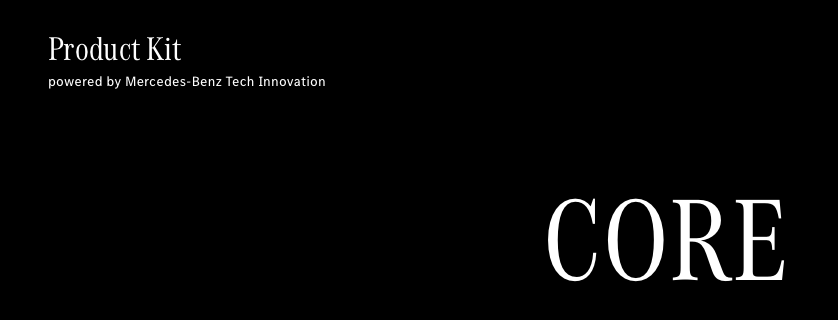

<!-- SPDX-License-Identifier: MIT --->

# 


[](https://www.npmjs.com/package/@mercedes-benz/productkit-core)

> **Note** <br>
> With the release of v2.2.0 and all future versions, product-kit_core is available under the npm scope @mercedes-benz/productkit-core.

Product Kit Core provides design tokens according to the Mercedes-Benz Tech Innovation styleguide. These tokens are used to create an export that can be used on web platforms using material design. The export is created with a build tool that is called [Style Dictionary](https://github.com/amzn/style-dictionary).

You can use the export to apply the styling by yourself or use one of the following implementations:

* [Tailwind](https://github.com/mercedes-benz/product-kit_tailwind)
* [Vue](https://github.com/mercedes-benz/product-kit_vue)

The export can be extended to support other platforms like iOS or Android. Feel free to open an [issue](https://github.com/mercedes-benz/product-kit_core/issues) or provide a pull request with the desired export.

## Installation

_Note that you must have node (and npm) installed._

You can get the style dictionary for web as package through npm:

```bash
npm install @mercedes-benz/productkit-core
```

Styles for web can be found in the `dist` directory. Feel free to contribute any missing platforms.

If you don't want to use the npm package clone the repository and get the files from the `dist` directory directly.

## Usage

You can access a wide variety of color, typography, component, layout, opacity, size or shape tokens for `css`, `javascript` or `sass`.

A typical token looks like this (css):

```css
--color-application-primary: var(--color-brand-goldentainoi-300);
```

This color tokens references another token. Note `application` and `brand` in the token names. You should only use `application` tokens in your code. These `application` tokens are created so they can be used in common styling use case scenarios in your application.

_Note that you don't need to implement Product Kit Core yourself in order to get styled components like buttons or textfields. You can use component libraries which are already styled with Product Kit Core for [Angular](https://github.com/mercedes-benz/product-kit_angular) (Angular Material), [React](https://github.com/mercedes-benz/product-kit_react) (MUI) and [Vue](https://github.com/mercedes-benz/product-kit_vue) (Vuetify). Even if your use case is mainly static sites without much user interaction we recommend you use a framework like [MUI](https://mui.com) (React)._

## Contributing

We welcome any contributions.
If you want to contribute to this project, please read the [contributing guide](CONTRIBUTING.md).

## Code of Conduct

Please read our [Code of Conduct](https://github.com/mercedes-benz/foss/blob/master/CODE_OF_CONDUCT.md) as it is our base for interaction.

## License

This project is licensed under the [MIT LICENSE](LICENSE).

## Provider Information

Please visit <https://www.mercedes-benz-techinnovation.com/en/imprint/> for information on the provider.

Notice: Before you use the program in productive use, please take all necessary precautions,
e.g. testing and verifying the program with regard to your specific use.
The program was tested solely for our own use cases, which might differ from yours.
